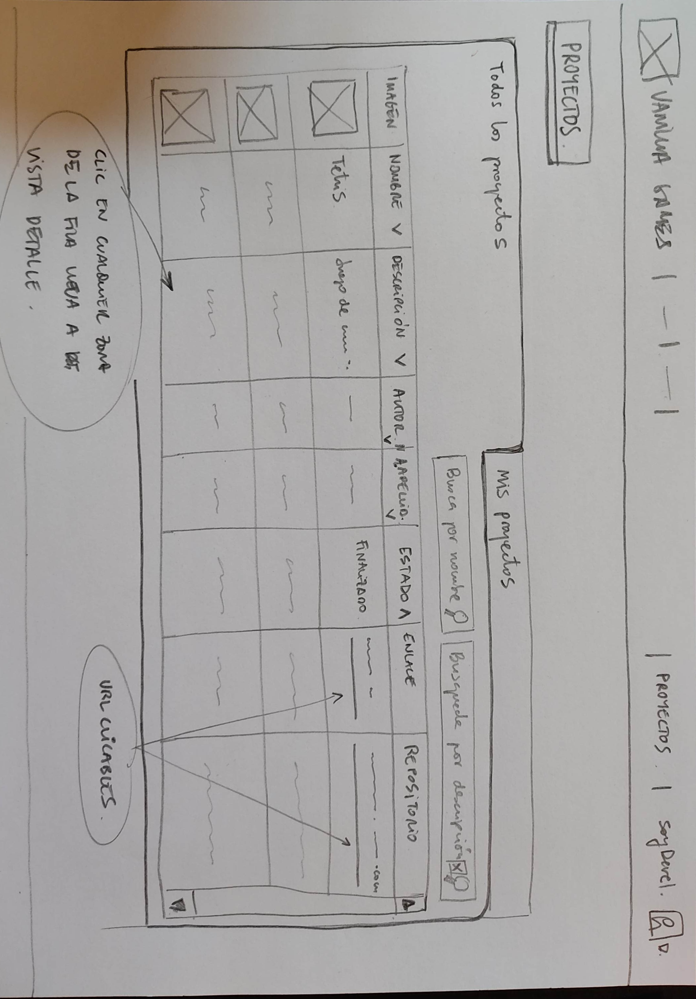

# Requesitos y diagrama de casos de uso
En la introducción de esta documentación, en la sección El proyecto Vanilla Games, en concreto en el apartado Requisitos del proyecto y casos de uso general, hemos definido qué se espera de nuestra aplicación web, a partir de los 'Casos de uso general'.

También hemos dividido todo el trabajo de desarrollo en diferentes versiones, con la intención de que nuestro proyecto esté operativo desde el inicio de su implementación, de manera que conforme evolucione a posteriores versiones, aumentaremos su nivel de funcionalidad.

Por lo tanto, vamos a comenzar por la versión 1.0.

Lo primero es definir los casos de uso para esta versión. Una primera aproximación podría ser la siguiente:

RECUERDA QUE...
Los casos de uso son una herramienta esencial para comprender y especificar los requisitos de un sistema, y para garantizar que el software desarrollado satisfaga las necesidades de los usuarios finales.

## Casos de uso para la V1.0 - Definición básica
Registrar usuario: Un usuario puede registrarse en la plataforma proporcionando su nombre, apellidos, email y contraseña.
Recuperar contraseña: Un usuario registrado puede solicitar la recuperación de su contraseña en caso de que la haya olvidado. Para ello, se le enviará un correo electrónico con las instrucciones para restablecer su contraseña.
Iniciar sesión: Un usuario registrado puede iniciar sesión en la plataforma proporcionando su email y contraseña.
Cerrar sesión: Un usuario puede cerrar su sesión en la plataforma en cualquier momento.
Editar perfil: Un usuario registrado puede editar su perfil, actualizando su nombre, apellidos, email o contraseña.
Ver proyectos: Un usuario registrado puede ver un listado de proyectos publicados por los desarrolladores.
Publicar proyecto: Un usuario con el perfil de desarrollador puede publicar un proyecto proporcionando información como nombre, descripción, imagen representativa, enlaces a servidor de pruebas y repositorio de código, estado del proyecto, etc.
Editar proyecto: Un usuario con el perfil de desarrollador puede editar un proyecto que haya publicado previamente, actualizando la información del proyecto.
Eliminar proyecto: Un usuario con el perfil de desarrollador puede eliminar un proyecto que haya publicado previamente.
Ver/Editar usuarios: Un adminsrador puede ver una tabla con todos los usuarios que hay registrados y editar la información, incluido el ROL de usuario.
Eliminar usuario: Un administrador puede eliminar cualquier usuario registrado en la plataforma.
## Diagrama de casos de uso
Para tener la información de manera gráfica vamos a utilizar uno de los diagramas UML que aprendimos a hacer el curso pasado:

INFO
¿Qué es un diagrama UML?
¿Qué es un diagrama de casos de uso?
Vamos a crear nuestro diagrama de casos de uso.

TIP
Para dibujar el diagrama de casos de uso una herramienta interesante puede ser FIGMA..

Figma es una herramienta de diseño de interfaces de usuario (UI) y experiencia de usuario (UX) basada en la nube. Permite a los diseñadores crear, prototipar y colaborar en diseños interactivos de alta calidad de forma colaborativa.

El diagrama de casos de uso para la versión 1.0 sería el siguiente:

### Diagrma de casos de uso para la versión 1.0

Este diagrama refleja de forma resumida qué acciones se pueden llevar a cabo en nuestro aplicación dependiendo del rol del usuario.

Ahora que tenemos claro todo lo que debe hacer la versión 1.0, nuestra misión ahora es planificar el trabajo que se nos viene encima...

# PLANIFICACIÓN DEL PROYECTO
## Planificación del proyecto
¡Estamos listos y hemos comenzado a desarrollar la versión 1.0 de nuestro proyecto!

En el apartado anterior hemos definido qué funcionalidades debe tener. Además, hemos analizado las diferentes arquitecturas y tecnologías y hemos optado por utilizar una CSR (Client Side Rendering basada en una SPA programada en Javascript y conectada a Supabase como servicio backend).

Por lo tanto estamos en condiciones de definir cada una de las tareas que necesitaremos realizar para llevar a cabo esta primera versión del proyecto.

Para poder planificar el trabajo, vamos a crear el 'backlog de proyecto', es decir, vamos a desglosar el trabajo en historias para, a continuación, crear el backlog de sprint (donde agruparemos las historias por entregas). Finalmente vamos a planificar su temporización, es decir, vamos a asignar un tiempo determinado a cada historia.

INFO
¿Qué es el backlog de producto?
### Backlog de producto y de sprint.
Estas serían las historias a planificar en la entrega de la versión 1 de nuestro proyecto agrupadas por sprints:

#### SPRINT 0: Definición del proyecto
Historia: Requisitos, casos de uso y diagrama de casos de uso Como desarrollador, quiero definir de manera genérica las especificaciones de la aplicación.

Historia: Versiones y planificación Como desarrollador, quiero agrupar las especificaciones en versiones, definir las tareas necesarias y realizar la planificación de todo el proceso de desarrollo del proyecto.

Historia: Casos de uso especificos y diagramas de flujo Como desarrollador quiero definir las especificaciones y casos de uso para la versión 1.0.

(Esta historia ya hemos comenzado a trabajarla en apartados anteriores. No obstante, es importante que quede constancia de ello para poder hacer una valoración del tiempo total invertido.)

#### SPRINT 1: Diseño de la interficie
Historia: Bocetos: Como diseñador quiero dibujar los bocetos de todas las posibles pantallas del proyecto y testear su funcionamiento.
Historia: Wireframes, Mockup y guía de estilos: Como diseñador quiero dibujar los mockups y crear la guía de estilos a partir de los colores, tipografías, etc seleccionadas.
#### SPRINT 2: Prototipos
Historia: Entorno de desarrollo: Como diseñador/programador quiero instalar y configurar las herramientas necesarias para programar la aplicación, trabajar con repositorios y crear un entorno integración continua y despliegue continuo.
Historia: Prototipos html: Como maquetador web quiero crear las páginas html del proyecto a partir de los wireframes aplicando la guía de estilos y utilizando Bootstrap 5.
Historia: Validaciones de formularios: Como programador quiero definir e implementar las validaciones de los formularios del proyecto
#### Sprint 3: Implementación de la SPA
Historia: Entorno de desarrollo basado en NodeJS: Como programador quiero instalar y configurar todas las herramientas necesarias (NodeJS, Vite, etc.) para el desarrollo de una app tipo SPA basada en Javascript
Historia: Creación de proyecto basado en SPA y organización de archivos para las vistas basadas en módulos js: Como programador quiero configurar el sistema de carpetas para las vistas y crear los archivos a partir de componentes html basados en los prototipos.
Historia: Creación de componentes: Como programador quiero crear los componentes para el encabezado, el enrutado de las páginas y los menús.
Historia: Diseño del aspecto de las vistas: Como usuario quiero poder navegar por todas las vistas de la aplicación (independientemente del del rol).
Historia: Implementación de la lógica para la validación de los formularios: Como usuario quiero recibir feedback de validación en las vistas con formularios.
Historia: Lógica para la autenticación de usuarios: Como usuario registrado quiero poder recordar los datos de sesión al loguearme (Uso de localStorage)
Historia: Actualización de componentes header y menús en función del rol de usuario logueado: Como usuario logueado quiero poder navegar por las vistas de la aplicación. (Podrán verse solo las opciones que corresponden a mi rol).
Historia: Diseño de las vistas a partir de los datos de un archivo JSON: Como programador quiero simular el registro, login y visualización de las tablas de usuarios y proyectos a partir de datos ficticios obtenidos de una archivo json de prueba.
Historia: Lógica para la administración de usuarios y proyectos (ver, editar, borrar, etc.): Como administrador quiero poder gestionar los usuarios y proyectos (CRUD)
#### Sprint 4: Backend
Historia: Diseño de la base de datos: Como programador quiero diseñar la base de datos en base a diagrama UML (diagrama entidad-relación)

Historia: Implementación de las tablas y funciones en supabase: Como programador quiero implementar las bases de datos en Supabase, diseñar las consultas e implementar las funciones postgree multitabla

Historia: API javascript de Supabase: Como programador quiero probar las apis de javascript para el acceso a la base de datos

Historia: Implementación de un ORM para mapping de la base de datos: Como programador quiero diseñar el diagrama de clases e implementarlo en javascript para tener un mapping de la bd.

#### Sprint 5: Integración del frontend y el backend
Historia: Login y registro: Como usuario quiero poder registrarme e iniciar sesión.

Historia: Gestión de sesiones: Como usuario registrado quiero ver la web en base al rol que tengo asignado.

Historia: Editar perfil Como usuario registrado quiero poder ver y modificar mi perfil.

Historia: Gestión de Proyectos (Vista proyectos, detalle proyecto, etc): Como usuario registrado 'desarrollador' quiero poder ver los proyectos, ver mis proyectos, crear proyectos, ver detalle de los proyectos y editar y borrar mis proyectos.

Historia: Gestión de usuarios: Como usuario registrado 'administrador' quiero poder ver, editar y borrar los usuarios del sistema.

#### Sprint 6: Revisión y despliegue en producción de la versión 1.0
Historia: Test de usuarios Como diseñador quiero realizar tests de usuarios a un grupo de usuarios focales.

Historia: Revisión de la aplicación Como programador quiero revisar y corregir los posibles problemas detectados en el test de usuarios.

Historia: Despliegue en producción Como programador quiero despleguar la aplicación en producción.

Ahora que tenemos las historias definidas es el momento de planificar el trabajo. Para ello necesitamos una herramienta que nos permita gestionar y temporizar cada una de las tareas. Nosotros utilizaremos GitHub Projects

# Hist3a - Diseño de la interfaz. Bocetos
Una vez tenemos claro las funcionalidades que debe realizar nuestra aplicación, comenzamos con el diseño de la interfaz.

Este proceso incluye diseñar los bocetos, los wireframes y los mockups ,para acabar creando los prototipos con html.

Sin duda, el primer paso, debe ser dibujar los bocetos, así que, busca un lápiz, una goma de borrar y un puñado de papel, ¡y manos a la obra!

## Deseño de Bocetos
INFO
Recuerda que los bocetos son dibujos a mano alzada que representan ideas de diseño de manera rápida y no detallada. Los bocetos suelen ser utilizados al inicio del proceso de diseño para explorar diferentes ideas y soluciones de diseño de manera rápida y económica. Los bocetos son ideales para hacer borradores rápidos y para discutir ideas con colegas y clientes.

### Home y menús usuarios

Hemos didivido la interficie en 3 zonas, el encabezado (header), el cuerpo principal (main) y el pie de página (footer).

En el header vamos a alojar una barra superior fija con: el logo y nombre de la web (que hará las veces de link a la página principal), un menú central genérico (para acceder a páginas públicas), un menú central específico (que será diferente en función del rol de usuario logueado), y un icono (avatar) que permitirá ver la imagen del usuario logueado y que hará de botón para desplegar otro menú, el menú de usuario (que tendrá diferentes items dependiendo de si la sesió está abierta o no y del tipo de rol que tenga el usuario logueado).
El cuerpo (main) albergará el contenido de las páginas. Será la sección que vaya cambiando dependiendo de la página que carguemos. En la página home simplemente aparece una imagen de fondo y el nombre de la web.
El header será meramente informativo.
### Regitro de un usuario

### Iniciar sesión

### Editar mi perfil

 Editar perfil será una ventana modal, es decir, se mostrará la ventana y el fondo se volverá oscuro.

Esta ventana de edición permitirá, además de modificar los datos del usuario, añadir una imagen de avatar. Por el momento, en esta primera versión, podremos añadir el link de una imagen que esté alojada en un servidor. En la siguiente versión (versión 1.1) actualizaremos esta ventana para que puedan subirse archivos (imágenes) al servidor.

### Listado de todos los proyectos

En esta página podemos ver, en la pestaña izquierda, todos los proyectos en forma de tabla. La pestaña derecha mostrará solo los proyectos que ha subido el usuario que ha iniciado la sesión.

Al hacer clic en cualquier parte de la fila se accede al detalle del proyecto.

También tenemos un buscador que permite buscar proyectos por palabras clave en el nombre o descripción.

Las celdas de encabezado de las tablas incluyen un icono (flecha hacia arriba o hacia abajo) que permitirá ordenar la tabla por la columna en concreto.

### Listado de Mis proyectos

En esta pestaña podemos ver los trabajos pertenecientes al usuario logueado. En cada fila aparece, además, un icono para editar y borrar el proyecto correspondiente. Por otro lado tenemos la opción de subir un nuevo proyecto.

Habría que valorar si es mejor crear un único buscador para el nombre y descripción del proyecto o dos barras de busqueda, una para cada sección, tal y como se muestra en el boceto anterior.

### Detalle de un proyecto

Si el usuario que está viendo la información de un proyecto en concreto es el autor de dicho proyecto, aparecerá un icono para la edición del mismo.

### Nuevo proyecto / Editar un proyecto

Esta vista sirve tanto para crear un nuevo proyecto como para editarlo.

Si el proyecto es nuevo, el botón mostrará el texto ENVIAR, pero si estamos editándolo aparecerá el texto ACTUALIZAR. Al crear o actualizar el proyecto, la web nos reenvía a la vista 'Detalle de proyecto'.

### Panel administración de proyectos

Si tienes el rol 'administrador' aparecerá el item 'Panel administración' en el menú superior específico. Este item nos permite cargar la vista 'Panel administración de proyectos'. Desde esta vista también podemos acceder al 'Panel administración de usuarios'.

Esta vista permite editar o borrar cualquier proyecto haciendo click en los iconos correspondientes. La opción editar nos llevará a la vista 'Editar proyecto'

### Panel administración de usuarios

Esta vista permite editar los datos de los usuarios. Por supuesto es solo accesible para los administradores.

En esta vista, el método para editar la información es diferentes. Aquí los datos aparecen sobre 'inputs', de manera que al hacer clic sobre ellos, aparecerá el cursor de edición. Se pueden modificar todos los datos (en especial el 'estado' y el 'rol' del usuario) excepto el email.